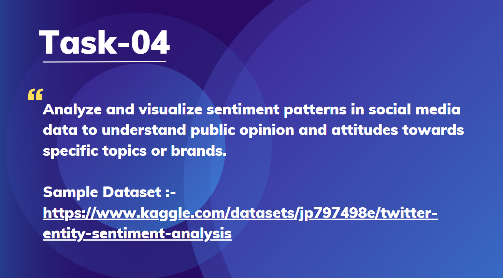

# Prodigy InfoTech Data Science Internship Task 4
 

### 🎯 Welcome to Task 4 Submission  

This project analyzes and visualizes **sentiment patterns** in social media data to understand public opinion on specific topics or brands. Using **Natural Language Processing (NLP)** techniques, the model classifies sentiments as **positive, negative, or neutral** and visualizes trends using graphs and charts.  

# Task-04  **Sentiment Analysis and Visualization of Social Media Data**  

## **📌 Objective**  
The objective of this project is to **analyze sentiment trends** in social media data to gain insights into public perception regarding a particular topic or brand. The analysis helps businesses and researchers understand user opinions and improve decision-making.  

## **📂 Dataset**  
[twitter_training.csv] This dataset consists of **social media posts, comments, or tweets** collected from various platforms. It includes:  

### 🔹 Features:  
- **Text Data:** Posts, comments, or tweets containing user opinions.  
- **Timestamp:** The date and time of the post for trend analysis.  
- **User Engagement:** Likes, shares, or retweets as additional indicators of sentiment strength.  

## **🛠️ Technologies Used**  
- **Python**  
- **Pandas & NumPy** (Data Handling)  
- **Matplotlib & Seaborn** (Visualization)  

## **📊 Analysis Highlights**  
- **Sentiment Classification:** Categorizing posts into **positive, negative, or neutral** sentiments.  
- **Trend Analysis:** Visualizing sentiment trends over time to identify key shifts in public opinion.  
- **Word Cloud & Key Phrases:** Extracting frequently mentioned words and phrases to understand discussion themes.  
- **Engagement Impact:** Analyzing how user engagement correlates with sentiment.  

## **🏁 Conclusion**  
This project provides valuable insights into public sentiment trends, enabling brands and researchers to **track public perception, respond to feedback, and refine strategies**. Future improvements could include **deep learning models like LSTMs or Transformer-based models** for more accurate sentiment detection.  
